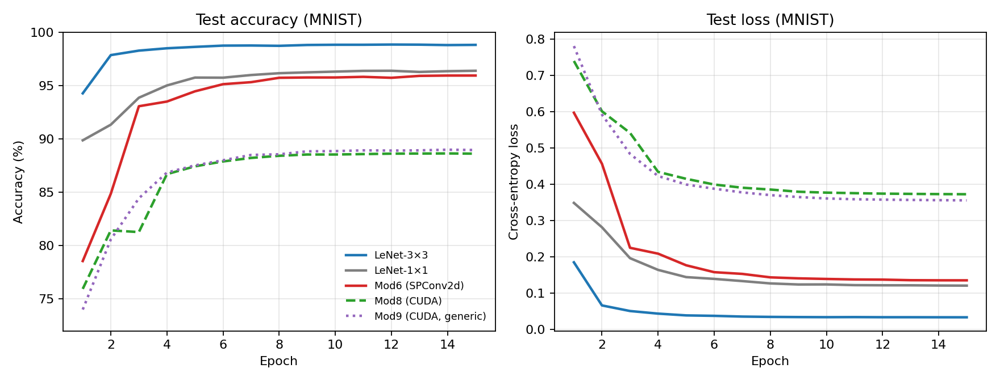
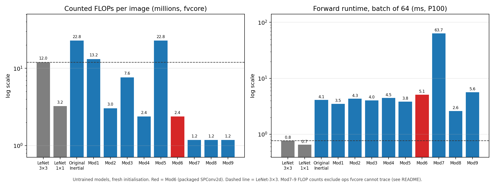
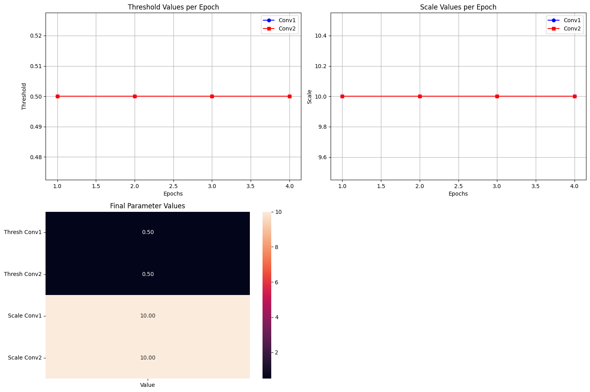

# Inertial Convolution for Efficient CNNs

[](https://pypi.org/project/ahdilaw/)
[](https://pypi.org/project/ahdilaw/)

**Inertial Convolution** replaces a dense 3×3 convolution with a much smaller *inertial filter*: a 1×1 core filter plus eight shared scalar "periphery" weights, and a divergence-based gate that decides, for every window, whether the periphery contributes. It is implemented in PyTorch and released on PyPI as [`ahdilaw`](https://pypi.org/project/ahdilaw/).

The name comes from physical inertia: an object keeps moving unless something acts on it. Likewise the layer "coasts" on the cheap core response where a window is uniform (low divergence, low "friction") and only brings in the neighbourhood where the local pixel values change.

> *Inertia as a Form of Model Compression in Convolutional Neural Networks*, Deep Learning course project (Group 39), LUMS, Spring 2025.

📄 [Project report](https://drive.google.com/file/d/198dEWkzRCi1IqEbxGuQjRVoY-bnIw1C2/view?usp=share_link) · 📦 [PyPI package](https://pypi.org/project/ahdilaw/)

## Motivation

CNNs are accurate but expensive, and deploying them on mobile or embedded hardware means cutting parameters, memory and compute. A standard d×d convolution costs d² weights and d² multiply-accumulates per input channel and output position. Inertial Convolution asks whether most of that is needed:

- **Fewer learnable parameters.** Each layer learns one 1×1 core (`C_out × C_in`) and 8 shared periphery scalars instead of `9 × C_out × C_in` weights.
- **Input-adaptive behaviour.** A divergence measure looks at each window and picks between a core-only path and a periphery-weighted path.

It draws on ideas from [Dynamic Sparse Convolutions](https://arxiv.org/pdf/2102.04906), [Skip-Convolutions](https://openaccess.thecvf.com/content/CVPR2021/papers/Habibian_Skip-Convolutions_for_Efficient_Video_Processing_CVPR_2021_paper.pdf) and [Fractional Skipping](https://arxiv.org/abs/2001.00705), but focuses on parameter reuse and divergence-aware skipping.

## How it works

For each 3×3 window of the input (all channels), with centre pixel `x_c` and neighbours `x_1 … x_8`:

1. **Core response.** A learnable 1×1 core `W ∈ R^{C_out×C_in}` is applied to the centre pixel.
2. **Divergence ("friction").** `d = Σ_channels Σ_i (x_i − x_c)²`, the squared difference between the neighbours and the centre, summed over channels. This is a fixed computation with no learned kernel.
3. **Gate.** `m = sigmoid((d − threshold) · scale)`, hardened to 0/1 (`m > 0.5`) in the forward pass.
4. **Output.**
   - `m = 0` (low divergence): `W · x_c`, the core response only.
   - `m = 1` (high divergence): `W · (Σ_i p_i · x_i)`, where `p ∈ R^8` are **learned periphery weights shared across all channels and filters**. The neighbourhood is aggregated first, then mixed by the same core.

**Learnable parameters per layer:** `C_out·C_in + 8 + 2` (core, periphery, threshold, scale) versus `9·C_out·C_in + C_out` for `nn.Conv2d(k=3)`. For the two LeNet convolutions that is **2,100 vs 18,816 parameters (−88.8%)**.

The design went through ten iterations (Original → Mod9); see [Design iterations](#design-iterations). **Mod6** is the packaged layer (`SPConv2d`); Mod8 and Mod9 are fused CUDA kernels.

## Installation

```bash
pip install ahdilaw
```

Requires Python ≥ 3.7 and PyTorch (`pybind11` is installed as a dependency).

## Usage

`inertial.special.SPConv2d` can stand in for a 3×3 `nn.Conv2d`, as in the network below. It supports 3×3 windows only and, in the notebook implementation (Mod6), has no bias term:

```python
import torch.nn as nn
import torch.nn.functional as F
from ahdilaw import inertial

class LeNetSP(nn.Module):
    """PyTorch's MNIST example network with both convolutions swapped for SPConv2d."""
    def __init__(self):
        super().__init__()
        self.conv1 = inertial.special.SPConv2d(1, 32, kernel_size=3, stride=1)
        self.conv2 = inertial.special.SPConv2d(32, 64, kernel_size=3, stride=1)
        self.dropout1 = nn.Dropout(0.25)
        self.dropout2 = nn.Dropout(0.5)
        self.fc1 = nn.Linear(9216, 128)
        self.fc2 = nn.Linear(128, 10)

    def forward(self, x):
        x = F.relu(self.conv1(x))
        x = F.relu(self.conv2(x))
        x = F.max_pool2d(x, 2)
        x = self.dropout1(x).flatten(1)
        x = self.dropout2(F.relu(self.fc1(x)))
        return F.log_softmax(self.fc2(x), dim=1)
```

The full training script is in [`mnist_lenet_.ipynb`](mnist_lenet_.ipynb). Mod8 and Mod9 are compiled inline with `torch.utils.cpp_extension.load_inline` inside [`analysis_.ipynb`](analysis_.ipynb) and [`benchmarking_full_mnist_.ipynb`](benchmarking_full_mnist_.ipynb); they need a CUDA GPU and `nvcc`.

<!-- TODO: confirm which layers the PyPI package exposes besides SPConv2d, and update the earlier README snippet that used inertial.special.Conv2d -->

## Experimental setup

Everything is trained on **MNIST** with two 3×3-window conv layers (32 and 64 filters), 15 epochs, Adadelta (lr 1.0, StepLR γ = 0.7). Two setups were used:

| | Setup A: baseline notebook | Setup B: full benchmark |
|---|---|---|
| Notebook | `mnist_lenet_.ipynb` | `benchmarking_full_mnist_.ipynb` |
| Recipe | PyTorch MNIST example (dropout 0.25 / 0.5, NLL loss) | no dropout, cross-entropy loss |
| Batch size / seed | 64 / 1 | 1024 / 42 |
| Hardware | single GPU | 2× Tesla T4, `DataParallel` |
| FLOP counter | `torch.utils.flop_counter` (counts multiply *and* add) | `fvcore` (1 multiply-accumulate = 1 FLOP) |
| Models | LeNet-3×3, LeNet-1×1, LeNet-SP (Mod6) | + Mod8, Mod9 |

FLOPs are for a single 28×28 image. The two counters differ by exactly 2× (for example LeNet-3×3 is 23,984,896 in A and 11,992,448 in B), so ratios agree across setups. Model size is the size of the saved `state_dict`.

All numbers are from **single runs** with one seed.

## Results

### Setup B: five-model comparison (full training)

| Model | Params | FLOPs (fvcore) | Size (MB) | Test accuracy |
|---|---:|---:|---:|---:|
| LeNet-1×1 | 1,609,226 | 3,237,632 | 6.14 | 96.41% |
| LeNet-3×3 | 1,199,882 | 11,992,448 | 4.58 | **98.84%** |
| **Mod6** (`SPConv2d`) | 1,183,166 | 2,382,208 | 4.52 | 95.96% |
| Mod8 (CUDA) | 1,183,260 | 1,180,928 ‡ | 4.52 | 88.63% |
| Mod9 (CUDA, generic) | 1,183,260 | 1,180,928 ‡ | 4.52 | 88.97% |

‡ Not comparable with the other rows; see [What the FLOP counts do and do not include](#what-the-flop-counts-do-and-do-not-include).



### Setup A: baseline recipe (PyTorch example)

| Model | Params | FLOPs (2×MAC) | Test accuracy |
|---|---:|---:|---:|
| LeNet-3×3 | 1,199,882 | 23,984,896 | **99.14%** |
| LeNet-1×1 | 1,609,226 | 6,475,264 | 96.47% |
| LeNet-SP (Mod6) | 1,183,166 | 4,764,416 | 97.38% |

### Mod6 against the baselines

| | vs LeNet-3×3 | vs LeNet-1×1 |
|---|---:|---:|
| FLOPs (counted) | −80.1% | −26.4% |
| Parameters | −16,716 (−1.4%) | −426,060 (−26.5%) |
| Model size | −1.4% | −26.5% |
| Accuracy, setup B | −2.88 pp | −0.45 pp |
| Accuracy, setup A | −1.76 pp | +0.91 pp |

### Design iterations

Each modification was profiled on the same 28×28 batch of 64 (P100, mean of 30 forward passes after warm-up). Models were **untrained** at this stage, so accuracy is not reported here; the comparison is about cost.

| Model | Change | Params | FLOPs / image | Runtime (ms) |
|---|---|---:|---:|---:|
| LeNet-3×3 | baseline | 1,199,882 | 12.0 M | 0.77 |
| LeNet-1×1 | baseline | 1,609,226 | 3.2 M | 0.65 |
| Original | 1×1 core zero-padded into a 3×3 kernel, absolute-difference divergence, fixed threshold, both branches computed | 1,183,148 | 22.8 M | 4.11 |
| Mod1 | true 1×1 core operation instead of zero-padding | 1,183,148 | 13.2 M | 3.50 |
| Mod2 | learnable threshold, squared-difference divergence, straight-through estimator | 1,183,148 | 3.0 M | 4.32 |
| Mod3 | explicit if/else computing a single branch; extra 3×3 detailed kernel and learnable scale | 1,201,870 | 7.6 M | 4.03 |
| Mod4 | shared periphery weights (8 per layer) replace the detailed kernel | 1,183,166 | 2.4 M | 4.46 |
| Mod5 | GPU-oriented variant of Mod4 | 1,183,166 | 22.8 M | 3.83 |
| **Mod6** | Mod4 + `stride`/`padding` arguments, so it matches `nn.Conv2d` calls (**`SPConv2d`**) | 1,183,166 | 2.4 M | 5.10 |
| Mod7 | per-output-channel thresholds | 1,183,260 | 1.2 M ‡ | 63.68 |
| Mod8 | Mod7 fused into one custom CUDA kernel | 1,183,260 | 1.2 M ‡ | 2.61 |
| Mod9 | generic D×D window / K×K core CUDA kernel (configured 3×3 / 1×1) | 1,183,260 | 1.2 M ‡ | 5.64 |



The interim project report (Deliverable 4) describes an earlier version of the layer, before Mod1–Mod9; this README documents the final implementation. In that early version (LeNet with inertial 3×3 layers, 15 epochs unless noted, P100) the reported test accuracies were:

| Divergence / gating variant | Epochs | Accuracy |
|---|---:|---:|
| Absolute loss, hard mask threshold | 15 | 96.48% |
| Absolute loss, sigmoid threshold | 15 | 96.30% |
| JSD, sigmoid threshold | 15 | 96.27% |
| JSD, hard mask threshold | 15 | 96.00% |
| Absolute loss, hard mask threshold | 1 | 93.45% |
| Softmax, mask threshold | 1 | 93.33% |

The dense baselines for those runs were 99.17% (LeNet-3×3) and 95.74% (LeNet-1×1), so the early inertial layer sat about 2.7 points below the 3×3 model and about 0.7 above the 1×1 model. Hard masking was marginally ahead of sigmoid gating in these runs. At that stage the report itself notes that compute savings were not yet realised (the divergence and gating added cost, and the zero-padded 1×1 core saved no memory); Mod1 onwards address this.

<!-- TODO: reconcile 96.48% (report text) with 96.58% for inertial v1 in _metric_calculations_.xlsx, and the 96.30% label (absolute loss + sigmoid in the report text, JSD + sigmoid in the spreadsheet) -->

### Mod8 threshold / scale sweep

A sweep over threshold ∈ [0.05, 0.5] and scale ∈ [5, 50] (5 × 5 grid) was started for Mod8 but **only 6 of the 25 configurations finished**. Among those, accuracy ranged from 88.2% to 90.3%, with the best at threshold 0.05 and scale 16.25. The grid is too incomplete to say where the optimum lies.

## Discussion

### The trade-off

On MNIST, Mod6 gives up about 1.8–2.9 accuracy points relative to a dense 3×3 LeNet and roughly matches the 1×1 LeNet (ahead of it in setup A, 0.45 points behind in setup B), with fewer parameters than both baselines and about 80% fewer counted FLOPs than the 3×3 model. The setup A/B gap for Mod6 (97.38% vs 95.96%) is consistent with setup B taking far fewer optimiser steps (batch 1024 gives 885 updates over 15 epochs versus 14,070 at batch 64), We did not test this directly. With single runs, differences under about one point should not be over-read.

### Where the parameter savings are, and are not

The two convolution layers shrink from 18,816 to 2,100 parameters, but they were never most of the model: `fc1` alone holds about 1.18M of the 1.20M parameters. Whole-model parameters and file size therefore fall by only 1.4% against LeNet-3×3. The larger saving against LeNet-1×1 (26%) mostly reflects that network's bigger `fc1` (12,544 inputs, since 1×1 convolutions keep the 28×28 resolution). Getting substantial end-to-end compression would need the classifier head to shrink as well.

### What the FLOP counts do and do not include

FLOPs come from `fvcore`, which counts standard tensor operations but not custom ones. The numbers line up exactly with that:

- **Mod6: 2,382,208** = 1,201,280 (the 1×1 channel-mixing matrix multiplies in both layers) + 1,180,928 (`fc1` + `fc2`). The divergence computation and the periphery weighting are element-wise and are not counted.
- **Mod7/8/9: 1,180,928** = `fc1` + `fc2` only. Their convolution cost is invisible to the counter, so **these three rows are not a fair comparison with Mod6**. Functionally they do the same kind of work as Mod6.

Adding the divergence (about 0.15M operations, using the accounting in `_metric_calculations_.xlsx`) and the periphery weighting (at most about 0.15M) gives a rough estimate of **≈2.7M FLOPs for Mod6**, still roughly 78% below LeNet-3×3. This is a back-of-envelope estimate, not a measurement. The counted FLOPs should be read as an idealised operation count, not measured compute.

### What the gate does and does not save

In the current formulation both branches finish with the same 1×1 channel mixing, and the divergence has to be evaluated at every window before the gate can decide anything. The compute the gate can skip is therefore only the periphery weighting (at most `8 · C_in` multiply-adds per output position), which is small next to the `C_in · C_out` mixing. Our reading is that **most of the reduction relative to a 3×3 convolution comes from the factorised kernel** (1×1 core times eight shared scalars) rather than from skipping work in flat regions. We also did not measure gate activity, i.e. what fraction of windows take the periphery path on MNIST. Both are natural next steps (see [Future work](#future-work)).

### Wall-clock time does not follow FLOPs

Every inertial variant is slower than a plain convolution in wall-clock time. Forward passes on a batch of 64 take 0.77 ms for LeNet-3×3, versus 5.10 ms for Mod6 (≈6.6×) and 2.61 ms for the fused Mod8 (≈3.4×). Mod7, which does the same work with Python-level indexing and many small kernel launches, takes 63.7 ms (≈83×). Training epochs on 2× T4 show the same ordering: roughly 13 s for LeNet-3×3, 19–20 s for Mod6 and 15 s for Mod8. A likely reason is that dense convolutions run on heavily optimised cuDNN kernels, whereas data-dependent branching with gather/scatter is harder to make fast on a GPU; we did not profile this. Fusing the work into one kernel (Mod8) recovers most of the overhead. The current kernel recomputes the divergence separately for every output channel, so there is clear room to improve it. The efficiency gains here are in parameters and operation count, not latency.

### Threshold and scale are not learned

Threshold and scale stay exactly at their initial values throughout training: 0.1 and 10.0 for all 15 epochs in Mod6, Mod8 and Mod9, and 0.5 and 10.0 in a separate 4-epoch test (below). The gate is hard, and the layer selects branches from the hard mask, so no gradient reaches these parameters; in effect they are fixed hyperparameters. Learning them would need a differentiable formulation or a custom backward pass in the CUDA implementation.



### Mod8 and Mod9 accuracy

Mod8 and Mod9 reach only about 89% against Mod6's 96%. The CUDA extensions currently expose a forward function only, with no custom backward pass, so it is likely that the convolution weights are not being updated by the optimiser and that the network is effectively a trained classifier on fixed convolutional features. Their accuracy should be read with that in mind until a backward pass is implemented.

<!-- VERIFY before publishing: after loss.backward(), check whether model.conv1.core.grad is None for Mod8/Mod9 -->

### Scope and limitations

- Only MNIST has been used to evaluate the inertial layer. CIFAR-10 and Fashion-MNIST have baselines only.
- Two convolution layers, one seed, one run per configuration; no variance estimates.
- MNIST is grayscale with a mostly uniform background, which is probably a favourable case for a divergence-based gate. Behaviour on natural images is untested.
- Only on-disk model size was measured, not runtime memory. Mod6 builds 3×3 patches with `F.unfold`, which materialises roughly 9× the input feature map, so activation memory is likely *higher* than for a standard convolution. This echoes the interim report's point that the early design did not reduce RAM use.
- FLOP counts are idealised (see above), and runtimes are single measurements on one GPU.

## Future work

- Implement a backward pass for the CUDA kernels so Mod8/9 can train the convolution weights, and a learnable-threshold path.
- Measure gate activity per layer, and design a gate that skips real computation (for example, the channel mixing itself) rather than only the periphery weighting.
- Compute FLOPs analytically or with a counter that sees custom kernels, so all variants are comparable.
- Hoist the divergence out of the per-output-channel loop in the CUDA kernel.
- Shrink or replace the fully connected head to turn the convolutional savings into end-to-end compression.
- Evaluate on CIFAR-10 and Fashion-MNIST, where the baselines already exist, and with multiple seeds.
- Finish the Mod8 threshold/scale sweep.

## Baselines on other datasets

Reference models trained before the inertial layer was evaluated. The inertial layer has not yet been run on these datasets.

| Dataset | Model | Test accuracy |
|---|---|---:|
| CIFAR-10 | ResNet-18 / VGG-style CNN | 92.48% |
| Fashion-MNIST | FashionNet, 5×5 kernels | 83.38% |
| Fashion-MNIST | FashionNet, 3×3 kernels | 83.17% |
| Fashion-MNIST | FashionNet, 1×1 kernels | 81.69% |

<!-- TODO: state which model the single CIFAR-10 figure belongs to -->

## Repository contents

| File | Purpose |
|---|---|
| `mnist_lenet_.ipynb` | Setup A: LeNet-3×3, LeNet-1×1 and LeNet-SP trained with the PyTorch example recipe |
| `analysis_.ipynb` | Definitions of the original layer and Mod1–Mod9 (including the CUDA kernels) and the cost benchmark on untrained models |
| `benchmarking_full_mnist_.ipynb` | Setup B: full 15-epoch training of five models, the Mod8 sweep, and result plots |
| `thres_evolution_.ipynb` | 4-epoch test showing that threshold and scale are not learned under hard gating |
| `_metric_calculations_.xlsx` | Analytical parameter and FLOP calculations, and the measured-metrics table |
| `_metrics_.json`, `benchmarking_metrics_.pt` | Final metrics, and full per-epoch histories for setup B |
| `figures/` | Plots used in this README |

## Tools

PyTorch · CUDA (custom kernels via `load_inline`) · fvcore · NumPy · Matplotlib · Seaborn

## Authors

- **Ahmed Wali**
- **Labiba Shahab** ([@Labiba102](https://github.com/Labiba102))

Developed for the Deep Learning course at the Lahore University of Management Sciences (LUMS), Spring 2025.

## License

<!-- TODO: add a LICENSE file and name it here -->
